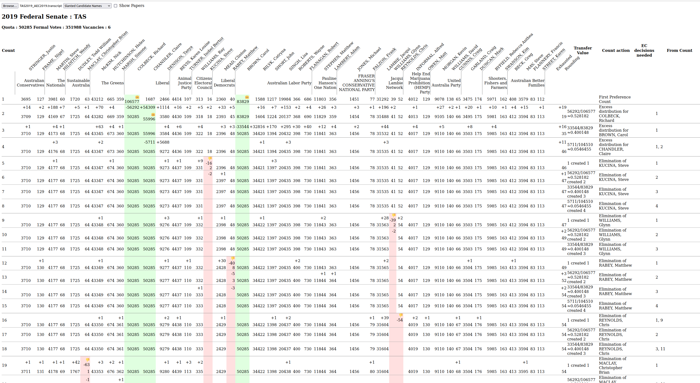

# ConcreteSTV

ConcreteSTV is a suite of programs used to count 
[Single Transferable Vote (STV)](https://en.wikipedia.org/wiki/Single_transferable_vote) elections, 
which are a form of preferential voting used to elect multiple candidates. They are
widely used in Australian elections.

Unlike many forms of voting, the actual counting of STV elections is not trivial, and
indeed there are many plausible quite different sets of rules for STV. 
The aim of ConcreteSTV is to implement versions of STV that are actually used in
a variety of jurisdictions. This emphasis on perfectly matching actual the
algorithms used in actual, concrete elections is where the name comes from.

ConcreteSTV is a rewrite of an [earlier project](https://github.com/SiliconEconometrics/PublicService)
but does not yet have all the features of the earlier project. However it
is more user friendly, and future development will be concentrating on
this project.  

Results from the earlier project were used to find and fix bugs [in the 2020 ACT STV count](reports/2020%20Errors%20In%20ACT%20Counting.pdf), and to identify bugs in the [2012](reports/NSWLGE2012CountErrorTechReport.pdf) and [2016](reports/2016%20NSW%20LGE%20Errors.pdf) NSW count which led the NSW Parliament to simplify the rules. Everyone is encouraged to use this code to double-check and correct election results.

## Currently Supported Election Rules

ConcreteSTV supports a variety of different rules. Each jurisdiction generally has its own legislation,
which changes over time, and then there is the actual implementation by the electoral commission which
is often buggy. ConcreteSTV aims to both provide the option of a correct count, and also the ability
to emulate the bugs of present in a particular year's count. There are also often ambiguities in the legislation,
in which case ConcreteSTV generally follows the corresponding electoral commissions's interpretation, unless that
changes over time.

See [ElectionRules.md](ElectionRules.md) for a detailed description of what each of the below options means. 
- **FederalPre2021** Federal Senate, my interpretation of the correct rules. Formerly named **Federal**
- **AEC2013** Possibly buggy rules used by AEC in 2013 Federal Senate election
- **AEC2016** Buggy rules used by AEC in 2016 Federal Senate election
- **AEC2019** Buggy rules used by AEC in 2019 Federal Senate election
- **ACTPre2020** Rules used for ACT Legislative Assembly by ElectionsACT prior to 2020.
- **ACT2020** Very buggy rules used by ElectionsACT in 2020
- **ACT2021** Rules that should have been used by ElectionsACT in 2020 and were used for the 2021 recount.
- **NSWLocalGov2021** My dubious interpretation of the new, very ambiguous, legislation for NSW local government elections introduced before the 2021 elections. 
- **NSWECLocalGov2021** Rules used by the NSWEC in the 2021 local government elections. This differs in many respects from my interpretation of the very ambiguous legislation. See [my thoughts](nsw/NSWLocalCouncilLegislation2021Commentary.md) for details.

This list is expected to grow as ConcreteSTV supports more jurisdictions.

### A short note on bugs

Bugs are expected in any computer program. I am sure ConcreteSTV contains lots of bugs. Electoral
Commissions are not chosen for their competence in computer software. It is unreasonable to expect
them to not have lots of bugs in their programs. What should be expected but is sadly rare
is that they be transparent enough to demonstrate what they do, and commit to the rules 
they will use before the election.

The rules that I have implemented are my best guesses at a plausible set of rules
that would produce the output that actually happens. There may well be a different
set of rules that also would produce the same output.

If my program matches their output exactly, is that evidence that the correct candidates
were elected? Only very weak evidence. For a start, I may have the same bug as the electoral
commission. This sounds unlikely, but it actually
happened once in prior work - my transcripts matched the AEC's perfectly, but later I found a bug
in my code. More importantly, the accuracy depends on the list of the votes provided by the
electroral commission, and there is rarely any meaningful evidence provided either to the public
or scrutineers that these
correspond to the physical ballots, and are not affected by hackers, malicious insiders, supply chain
insiders, OCR errors or other bugs. This could be mitigated by public random auditing.

Note that prior to 2020, the ACT counting code was publicly available on their website. It
also appears to be the least buggy EC code in practice. This was partially due to
third parties who pointed out issues before they cropped up in elections.

If you notice any bugs in ConcreteSTV, please contact me at the address at the bottom
of this file.

## To compile

ConcreteSTV is written in [Rust](https://www.rust-lang.org/). Install Rust (latest stable version
recommended), then run, in this directory,
```bash
cargo build --release
```

This will create several binary programs in the `target/release` directory.

If you get an error like `failed to run custom build command for ``openssl-sys v0.9.72`` `, then install the package `libssl-dev` on Ubuntu,
possibly `openssl-dev` on some other linux distributions.

## To get real election data (parse_ec_data)

Before we can count an election, we need the votes to count. ConcreteSTV uses a format 
with extension `.stv` to store votes and some metadata about the election.

Some electoral commissions publish
a list of votes that are used as the basis of their counts. Let's choose the federal 2019 election, state Tasmania.

We will use a subdirectory of the main project for these examples.
```bash
mkdir work
cd work
```
The example commands are for Linux; Windows and MacOS will be very similar.

We need a **.stv** file containing a list of votes and some metadata. We can get this from
the program `parse_ec_data` via the command
```bash
../target/release/parse_ec_data AEC2019 TAS --out TAS2019.stv
```
This says parse data for the 2019 federal election, state TAS, and put the results into 
the file `TAS2019.stv`. Running it produces an error as we don't actually have the
two needed election files to parse, but it tells us where to get them (or at least one of them):
```text
Error: Missing file SenateFirstPrefsByStateByVoteTypeDownload-24310.csv look in https://results.aec.gov.au/24310/Website/SenateDownloadsMenu-24310-Csv.htm
```
Go to said URL (or [use this direct link](https://results.aec.gov.au/24310/Website/Downloads/SenateFirstPrefsByStateByVoteTypeDownload-24310.csv)), download 'First preferences by state by vote type (CSV)' into your current directory, then try again. 
```text
Error: Missing file aec-senate-formalpreferences-24310-TAS.zip look in https://results.aec.gov.au/24310/Website/SenateDownloadsMenu-24310-Csv.htm
```
Sorry, we need another file. Download 'Formal Preferences - Tasmania' from the website ([or this direct link](https://results.aec.gov.au/24310/Website/External/aec-senate-formalpreferences-24310-TAS.zip)), then try again
```bash
../target/release/parse_ec_data AEC2019 TAS --out TAS2019.stv
```
It will parse for a second or two, and produce the desired file. Check in your directory, 
there should be a roughly 11MB file `TAS2019.stv`. You may look at it with a JSON viewer
if you wish. 

### Election data formats understood

Currently parse_ec_data can accept (as first argument) the following elections:
* Federal Senate : AEC2013, AEC2016, AEC2019 [AEC](https://results.aec.gov.au/)
* ACT Legislative assembly : ACT2008, ACT2012, ACT2016, ACT2020 [ElectionsACT](https://www.elections.act.gov.au/elections_and_voting/past_act_legislative_assembly_elections)
* NSW Local Government : NSWLG2021 [NSW Election Commission](https://www.elections.nsw.gov.au/) See [docs](nsw/parse_ec_data_lge.md) for specific instructions.

## To count (concrete_stv)

The `concrete_stv` program takes in a rule specification and a .stv file, and produces
a *.transcript* file containing the distribution of preferences for each count. We will
use the AEC2019 rules for this. Use the bold names in the section "Currently Supported Election Rules" above
as the name for the appropriate rules.

```bash
../target/release/concrete_stv AEC2019 TAS2019.stv --verbose
```

This will pause for a second as it reads the input, then print out a text version of the
distribution of preferences, which is somewhat hard to read (you can skip this by not
including the --verbose option). 
More importantly, it will also have created a roughly hundred kilobyte JSON file `TAS2019_AEC2019.transcript`, which we
will use in the next section for a prettier view. 

Note that you can pass --help as an option to either of these programs for details on options.

## To view a transcript

The `docs` folder of this project contains a web based viewer for transcript files.
Open `docs/Viewer.html` in a web browser. 

In the upper left corner, there will be a *Browse* button. Use it to select the `TAS2019_AEC2019.transcript`
file from before.

This will produce a large image similar to this:



Elected candidates have a background of pale green, excluded candidates of pale red. 
Votes, and the differentials for each count, are listed by default; you can also see 
the number of papers by selecting the "Show papers" box.

You can compare this to the [AEC provided transcript](https://results.aec.gov.au/24310/Website/External/SenateStateDop-24310-TAS.pdf).

Other STV counting programs include Grahame Bowland's [Dividebatur](https://github.com/grahame/dividebatur) 
and its successor [Dividebatur2](https://github.com/grahame/dividebatur2), Lee Yingtong Li's [OpenTally](https://yingtongli.me/git/OpenTally/), and Milad Ghale's [formally verified STV](https://github.com/MiladKetabGhale/STV-Counting-ProtocolVerification).

## Margins and modifications.

There is a program `change outcomes` that can find modifications that change the outcome of the
election, and thus are an upper bound on the margin. This program takes a `.stv` file like
`concrete_stv` and produces a `.vchange` file with details of what it found.

See [margins.md](margins.md) for details.

## Example data files

The `examples` directory contains some interesting contrived examples where the rules used matter.
```bash
cd ../examples
../target/release/concrete_stv AEC2013 MultipleExclusionOrdering.stv 
```
has winners W1, W2, W7, W6, W5, W4.
```bash
../target/release/concrete_stv AEC2016 MultipleExclusionOrdering.stv 
```
has different winners: W1, W3, W4, W5, W6, W7. This demonstrates that bulk exclusion can affect who wins, on a contrived example.
```bash
../target/release/concrete_stv AEC2019 MultipleExclusionOrdering.stv 
```
has winners W1, W3, W7, W6, W5, W4, the same as 2016 but in a different order. This shows that the priority of rule (18) affects the order in which candidates are considered elected.

## File formats

The .stv, .transcript, and .vchange files are all JSON format. 

The .stv files are a straight forward JSON representation of the `ElectionData` structure defined in
[election_data.rs](stv/src/election_data.rs) which reference structures in [ballot_paper.rs](stv/src/ballot_paper.rs), 
and metadata given by the `ElectionMetadata` structure in [ballot_metadata.rs](stv/src/ballot_metadata.rs)

The .transcript files are a straight forward JSON representation of the `TranscriptWithMetadata`
structure defined in [distribution_of_preferences_transcript.rs](stv/src/distribution_of_preferences_transcript.rs),
which uses the same metadata format.

One complication is the representation of numbers. In .stv files, there are only integers and they are represented by numbers.
In .transcript files there are non-integers. These are represented in the program as ratios of integers or as scaled integers, for exact precision.
Writing them as JSON numbers could lead to loss of precision.
* Transfer values are stored as JSON strings, either "1" or a ratio like "34/234".
* Most vote counts and ballot paper counts are stored as JSON numbers (integers).
* When a vote count could be a non-integer (e.g. ACT2020 or ACT2021 rules), vote tallys are stored as strings like "345.288272". Ballot counts are still stored as JSON numbers as they are integers
* Votes lost to rounding is a special case, as unlike all other numbers mentioned here it can be negative (ACT2020 rules). These are stored as JSON strings, even when using rule sets where they must be integers.

The .vchange files contain the .stv file, as well as a list of possible modifications. The only part
that is not straight forward is the list of affected votes. Affected votes are represented by a multiplicity and an
integer:
* If less than the number of entries in the `atl` array in the contained `.stv` file, it is an index into this `atl` array - an above the line vote.
* Otherwise, subtract the number of entries in the `atl` array, and it is now an index into the `btl` array of below the line votes.

## LaTeX tables

You can convert a .stv or (more commonly) .transcript file to a LaTeX table
by the `transcript_to_latex` program:
```bash
../target/release/transcript_to_latex --deltas MultipleExclusionOrdering_AEC2016.transcript > MultipleExclusionOrdering_AEC2016.tex
```

Note that these tables are generally too large to fit onto a normal page. To restrict the
table to a small number of candidates, use the `--candidates` option. Use the `--help`
option for details.

## Webserver

The webserver running on [https://vote.andrewconway.org](https://vote.andrewconway.org) uses ConcreteSTV. Running your
own copy is described in [ElectionDatabase.md](ElectionDatabase.md)

## Testing

Some of the tests (run with `cargo test`) require real data files downloaded from the
appropriate electoral commissions. See [ElectionDatabase.md](ElectionDatabase.md) for details.

## Copyright

This program is Copyright 2021 to 2022 Andrew Conway.

This file is part of ConcreteSTV.

With the exception of specific files mentioned below,
ConcreteSTV is free software: you can redistribute it and/or modify
it under the terms of the GNU Affero General Public License as published by
the Free Software Foundation, either version 3 of the License, or
(at your option) any later version.

ConcreteSTV is distributed in the hope that it will be useful,
but WITHOUT ANY WARRANTY; without even the implied warranty of
MERCHANTABILITY or FITNESS FOR A PARTICULAR PURPOSE.  See the
GNU Affero General Public License for more details.

You should have received a copy of the GNU Affero General Public License
along with ConcreteSTV.  If not, see <https://www.gnu.org/licenses/>.

### Other copyrights

This repository contains some files derived from data sources with their
own separate copyrights. These files are licensed as above to the extent that they are the work
of contributors to ConcreteSTV, and maintain the original copyright to the appropriate
extent.
* nsw/NSWLocalCouncilLegislation2021.md. Based on content from the 
  [New South Wales Legislation website](https://legislation.nsw.gov.au/view/whole/html/2020-10-27/sl-2005-0487#sch.5) at 3 Dec 2021. 
  For the latest information on New South Wales Government legislation please go to https://www.legislation.nsw.gov.au.
  It is licensed under a Creative Commons Attribution 4.0 International licence (CC BY 4.0).
* nsw/src/NSWLGE2021_contest_list.json and nsw/examples/putative_lost_ivotes.csv. These lists are partially derived from data on the 
  [NSW Electoral Commission website](https://www.elections.nsw.gov.au), which
  is © State of New South Wales through the NSW Electoral Commission 
  and licensed under the [Creative Commons Attribution 4.0 License](https://creativecommons.org/licenses/by/4.0/) (CCA License).
* The gh-pages branch of the git repository contains companion data for some papers
  associated with this project. They may contain data derived from other copyrighted information.
  See the copyright section in the index.html describing the companion page for details (these will be in the docs folder).

Kudos to the State of New South Wales for the use of such a license. 

This should not be taken as an endorsement of ConcreteSTV by any organisation listed here.

Or course any files you download from electoral commissions (or elsewhere)
are likely covered by their own licenses.


## Contact

Contact the author andrew at andrewconway.org